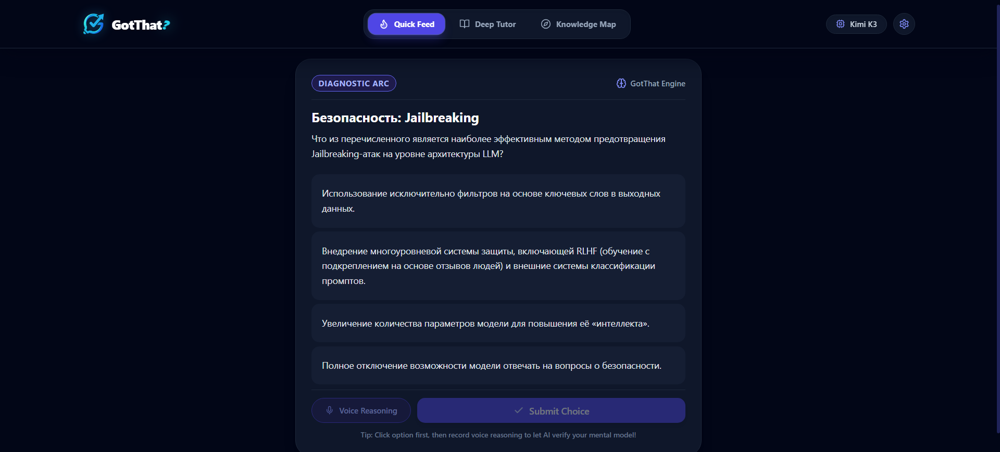
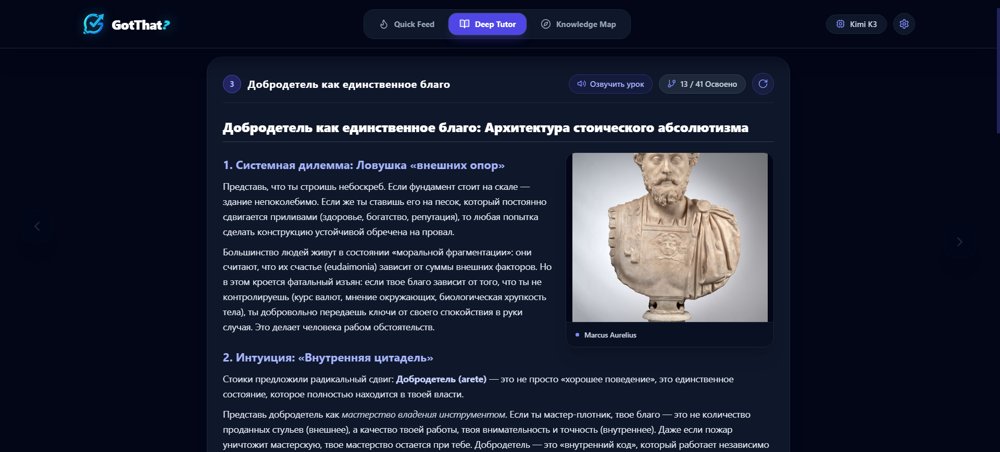
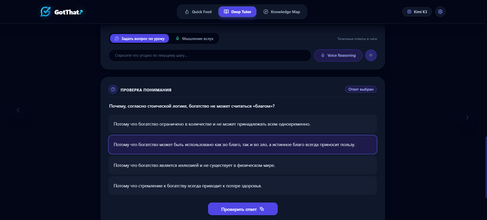
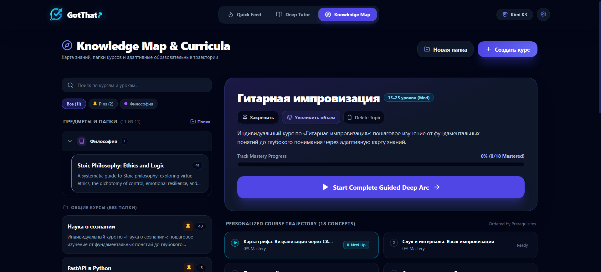
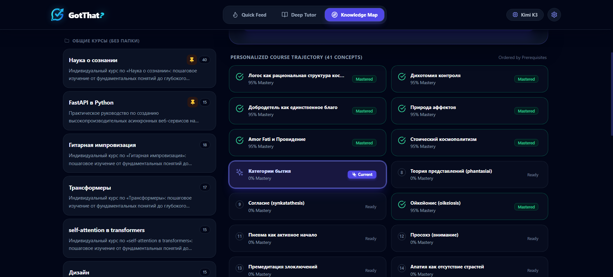
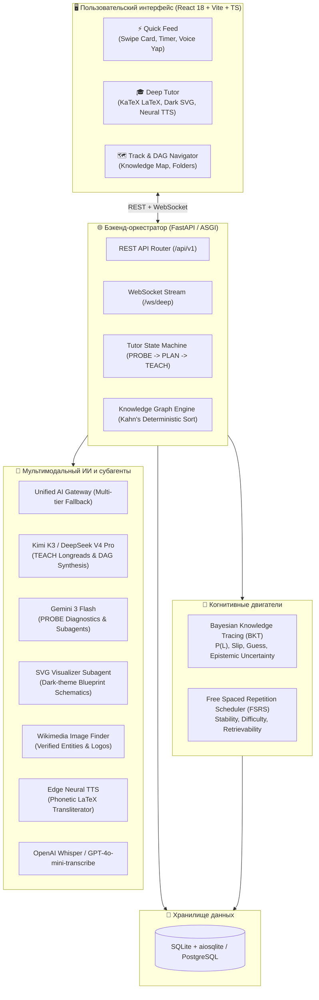

<div align="center">

# 🧠 GotThat? (GotIt Core Tutor)

**Платформа адаптивного обучения нового поколения с гибридной архитектурой: микрообучение (Quick Feed) и глубокий персональный 1-на-1 ИИ-тьюторинг на основе когнитивных моделей BKT и FSRS.**

[](https://python.org)
[](https://fastapi.tiangolo.com)
[](https://react.dev)
[](https://www.typescriptlang.org)
[](https://tailwindcss.com)
[](https://docs.sqlalchemy.org)
[](https://pytest.org)
[](LICENSE)

[Интерфейс и скриншоты](#-галерея-интерфейса) • [Архитектура](#-системная-архитектура) • [Инновации](#-ключевые-технологические-инновации) • [Быстрый старт](#-быстрый-старт) • [Лицензия](#-лицензия)

</div>

---

## 📖 О проекте

**GotThat?** устраняет фундаментальный кризис цифрового образования — разрыв между поверхностным «дофаминовым» микроконтентом и академическими монографиями, требующими колоссальных волевых усилий.

Платформа реализует **два взаимосвязанных режима обучения**, работающих на базе единого когнитивного профиля студента:

1. **⚡ Режим Quick Feed (Микрообучение)**:
   - Вертикальная лента адаптивных карточек-квизов (Single-Choice, Multiple-Choice, Free Reasoning).
   - Балансировщик между **интервальным повторением (FSRS)** для предотвращения угасания памяти и **исследованием фронтира онтологии (BKT)** для выявления пробелов.
   - **Голосовые рассуждения (Voice Reasoning / Yap Notes)**: объяснение ответа голосом в микрофон с транскрибацией через Whisper/STT, проверкой логической связности и персонализированным ИИ-коучингом.

2. **🎓 Режим Deep Tutor Arc (1-on-1 Глубокое погружение)**:
   - Образовательный цикл по методологии **Ричарда Фейнмана (First-Principles Thinking)**.
   - **4-фазный пайплайн**:
     1. `PROBE`: Диагностическое тестирование (10 калибровочных вопросов) для точного вычисления границы текущего понимания.
     2. `PLAN`: Динамический синтез графа курса (**Zero-to-Mastery DAG на 15–65+ концептов**) по принципу **Парето 20/80 (Top-Down)**: от целостной ментальной модели к базовым законам, прикладным механизмам и сложным edge-кейсам.
     3. `TEACH`: Атомарные уроки высокой когнитивной плотности с формулами в $\LaTeX$, живым кодом, векторными схемами SVG и аутентичными иллюстрациями из Wikimedia Commons.
     4. `VERIFY & REMEDIATE`: Блокировка шага до успешного решения прикладной задачи и динамическая адаптивная вставка корректирующих узлов при ошибках.

---

## 📸 Галерея интерфейса

### 1. Интеллектуальный Quick Feed (Диагностика и рассуждение)
Вертикальная лента интерактивных квизов с возможностью записи голосовых рассуждений для калибровки когнитивного состояния:


---

### 2. Урок Deep Tutor с историческими и научными иллюстрациями
Форматированные уроки высокой плотности с математическими выкладками в $\LaTeX$, фото-артефактами из Wikimedia Commons и синтезом речи:


---

### 3. Интерактивная проверка понимания и диалог с тьютором
Пошаговая верификация усвоения материала с контекстным чатом и поддержкой голосовых аргументов:


---

### 4. Карта знаний и каталогизация курсов
Управление онтологическими треками, группировка по предметным папкам, отслеживание общего прогресса и запуск адаптивных траекторий:


---

### 5. Персонализированная траектория курса (DAG онтология)
Детерминированный граф обучения (15–65+ концептов) со строгим соблюдением пререквизитов, статусами освоения и вероятностями мастерства:


---

## 🏛 Системная архитектура



---

## 🔬 Ключевые технологические инновации

### 1. Двойное когнитивное моделирование: BKT + FSRS
- **Bayesian Knowledge Tracing (BKT)**: Отслеживает скрытое вероятностное состояние усвоения концепта $P(L_t)$. При голосовом рассуждении параметр угадывания устанавливается в $P(G) = 0.01$, обеспечивая максимальный информационный выигрыш и быстро устраняя эпистемическую неопределенность.
- **Free Spaced Repetition (FSRS)**: Моделирует угасание следа памяти по формуле $R(t, S) = (1 + \frac{19}{81} \frac{t}{S})^{-0.5}$ и автоматически назначает повторения в точке падения ретривабилити до 90%.

### 2. Детерминированный топологический сортировщик (DAG Engine)
- Реализация модифицированного алгоритма Кана с Min-Heap и естественной сортировкой модулей (`M1.01`, `M1.02`...).
- Гарантирует строгое соблюдение пререквизитов и 100% повторяемость последовательности шагов при любых порядках чтения из базы данных.

### 3. Полиморфная дисциплинарная педагогика
- **Точные науки (физика, ракетостроение, математика)**: Строгие выкладки в $\LaTeX$ с размерностями величин и уравнениями.
- **Computer Science**: Архитектура памяти, протоколы, асимптотика $O(N)$ и идиоматичный код.
- **UI/UX и когнитивная эргономика**: Анализ через законы Фиттса, Хика и геометрию интерфейсов (Thumb Zones).
- **Гуманитарные науки и философия**: Диалектика, мысленные эксперименты и этимология.

### 4. Векторный визуализатор и реальные изображения
- **SVG Visualizer Subagent**: Автоматическая генерация высокодетализированных темных схем (`#0B0F19`, `#1E293B`, `#6366F1`) с контурами обратной связи.
- **Wikimedia Finder Subagent**: Интеграция аутентичных исторических фотографий, чертежей и схем.

### 5. Фонетическая транслитерация $\LaTeX$ в речь (Neural TTS)
Специализированный транслитератор преобразует математическую нотацию в естественную русскую речь перед синтезом:
- `\frac{\Delta v}{g_0}` $\to$ *«дельта v, делённое на g ноль»*
- `\nabla \times \mathbf{E}` $\to$ *«ротор вектора E»*
- `\sqrt{x^2 + y^2}` $\to$ *«квадратный корень из x в квадрате плюс y в квадрате»*

---

## 📁 Структура репозитория

```
GotThat/
├── app/
│   ├── api/
│   │   ├── v1/
│   │   │   ├── deep_tutor.py       # Эндпоинты сессий глубокого тьюторинга
│   │   │   ├── feed.py             # Эндпоинты быстрой ленты и микро-квизов
│   │   │   ├── tracks.py           # Управление треками, онтологией и DAG
│   │   │   └── users.py            # Профиль пользователя и настройки
│   │   └── ws/
│   │       └── deep_stream.py      # Двусторонний WebSocket стриминг
│   ├── core/
│   │   ├── database.py             # Асинхронная сессия SQLAlchemy и автомиграции
│   │   └── slug.py                 # Генератор читаемых транслитерированных слагов
│   ├── models/
│   │   ├── mastery.py              # Модели User, MasteryState, Attempt, VoiceLog
│   │   ├── ontology.py             # Модели Domain, Track, Concept, Dependency, Item
│   │   └── session.py              # Модели DeepLearningSession, DeepSessionStep
│   ├── schemas/                    # Pydantic v2 схемы валидации данных
│   └── services/
│       ├── ai/                     # LLM клиент, SVG генератор, Image finder, TTS, STT
│       ├── cognitive/              # Когнитивные движки BKT и FSRS
│       ├── feed/                   # Оркестратор ленты микрообучения
│       ├── graph/                  # Алгоритм Кана, онтология, генерация курсов
│       └── tutor/                  # Стейт-машина тьютора (PROBE, PLAN, TEACH)
├── frontend/
│   ├── src/
│   │   ├── api/                    # Типизированный HTTP/WS клиент
│   │   ├── components/
│   │   │   ├── common/             # LatexRenderer (KaTeX), SvgViewer, VoiceRecorder
│   │   │   ├── deep/               # DeepTutorScreen, StepViewer, VerificationLock
│   │   │   ├── feed/               # FeedScreen, QuizCard
│   │   │   └── tracks/             # TracksScreen, создание и расширение курсов
│   │   ├── types/                  # TypeScript интерфейсы
│   │   ├── App.tsx                 # Роутинг и состояние приложения
│   │   └── main.tsx                # Точка входа React
│   ├── package.json
│   └── vite.config.ts
├── tests/                          # 28 асинхронных pytest-тестов
├── docs/
│   ├── screenshots/                # Скриншоты экранов приложения
│   ├── ARCHITECTURE.md             # Глубокое архитектурное описание
│   └── API.md                      # Спецификация REST и WebSocket API
├── benchmark_ab_testing_results.md # Сравнительный бенчмарк LLM моделей
├── docker-compose.yml
├── Dockerfile
├── requirements.txt
├── LICENSE                         # Некоммерческая лицензия (CC BY-NC-SA 4.0)
└── .env.example                    # Шаблон переменных окружения
```

---

## 🚀 Быстрый старт

### Системные требования
- **Python**: 3.10+
- **Node.js**: 18.0+
- Ключ API для LLM (OpenAI-совместимый провайдер или Provod.ai)

### 1. Клонирование репозитория
```bash
git clone https://github.com/HiF2L/GotThat.git
cd GotThat
```

### 2. Настройка виртуального окружения Python
```bash
python -m venv venv

# Windows:
venv\Scripts\activate

# Linux / macOS:
source venv/bin/activate

# Установка зависимостей
pip install -r requirements.txt
```

### 3. Конфигурация переменных окружения
Создайте файл `.env` на основе шаблона:
```bash
cp .env.example .env
```

Отредактируйте параметры в файле `.env`:
```ini
# Основной провайдер LLM (Provod.ai / OpenAI)
OPENAI_API_KEY=your_openai_or_provod_key
OPENAI_BASE_URL=https://api.provod.ai/v1

# Модели
DEEP_MODEL=kimi-k3
PLAN_MODEL=gemini-3-flash-preview
FAST_MODEL=gemini-3-flash-preview

# Голосовой ввод (STT)
STT_API_KEY=your_proxyapi_or_openai_key
STT_BASE_URL=https://api.proxyapi.ru/openai/v1
STT_MODEL=gpt-4o-mini-transcribe

# Голосовой вывод (TTS)
TTS_ENGINE=edge
TTS_VOICE=ru-RU-SvetlanaNeural

# База данных
DATABASE_URL=sqlite+aiosqlite:///./got_it.db
```

### 4. Запуск бэкенда
```bash
uvicorn app.main:app --host 0.0.0.0 --port 8000 --reload
```
Интерактивная документация Swagger UI будет доступна по адресу: [http://localhost:8000/docs](http://localhost:8000/docs).

### 5. Запуск клиентского приложения
В отдельном окне терминала:
```bash
cd frontend
npm install
npm run dev
```
Интерфейс откроется по адресу: [http://localhost:5173](http://localhost:5173).

---

## 🐳 Запуск через Docker Compose

Для запуска всей системы (Бэкенд + Фронтенд + База данных) в изолированных контейнерах:

```bash
docker-compose up --build
```

- **Frontend UI**: [http://localhost:5173](http://localhost:5173)
- **Backend API**: [http://localhost:8000](http://localhost:8000)
- **Swagger Docs**: [http://localhost:8000/docs](http://localhost:8000/docs)

---

## 🧪 Тестирование и контроль качества

Платформа протестирована набором из **28 асинхронных интеграционных и модульных тестов**:

```bash
# Запуск тестов
python -m pytest -v
```

### Ключевые тест-сьюты:
- `test_full_arc_journey.py`: Полный сквозной цикл от старта сессии и 10 вопросов PROBE до компиляции DAG, решения квизов и финализации курса.
- `test_bkt_fsrs.py`: Валидация байесовского обновления вероятности усвоения, информационного выигрыша голоса и интервалов FSRS.
- `test_dag_pathfinder.py`: Проверка топологической корректности, отсутствия циклов и строгого порядка пререквизитов.
- `test_tts_service.py`: Тестирование фонетической транслитерации формул LaTeX в русскую речь.
- `test_track_expansion.py` & `test_track_deletion.py`: Каскадная целостность базы данных при манипуляциях с графом.

---

## 📊 Результаты бенчмаркинга моделей (A/B/C)

В репозитории представлен детальный сравнительный отчет эффективности различных связок LLM:

| Конфигурация | Стоимость цикла (PROBE+PLAN+TEACH+SVG) | Экономия | Средний объем урока |
|---|:---:|:---:|:---:|
| **Config A (Baseline: Kimi K3 везде)** | `20.12 ₽` | — | 468 слов |
| **Config B (Гибрид: Kimi K3 на TEACH, Flash на PROBE)** | `11.53 ₽` | **-43%** | 532 слова |
| **Config C (DeepSeek V4 Pro + Flash)** | **`2.08 ₽`** | **-89.5% (в 9.6 раз дешевле!)** | **707 слов** |

Подробные выкладки и примеры сгенерированных уроков доступны в документе [benchmark_ab_testing_results.md](benchmark_ab_testing_results.md).

---

## 📜 Лицензия

Данный проект распространяется под лицензией **Creative Commons Attribution-NonCommercial-ShareAlike 4.0 International (CC BY-NC-SA 4.0)**.

- **Разрешено**: Свободное использование в личных, образовательных и исследовательских целях, модификация и создание производных работ при условии сохранения аналогичной лицензии и указания авторства.
- **Запрещено**: Коммерческое использование, распространение в составе платных продуктов, монетизация или закрытие исходного кода.

Подробный текст лицензии доступен в файле [LICENSE](LICENSE).

---

<div align="center">
Разработано с ❤️ для глубокого и осознанного образования.
</div>
