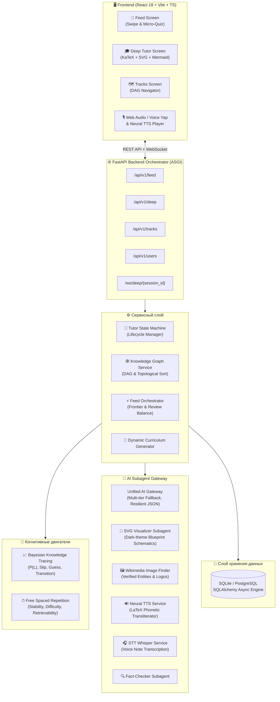
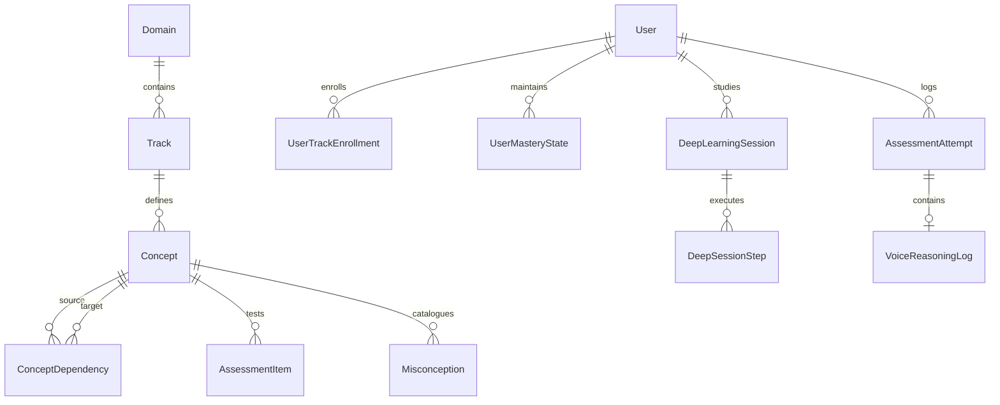
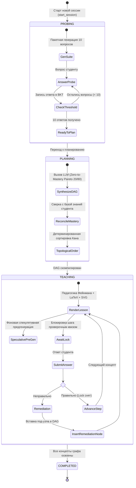

# 🏛 Архитектурная документация GotIt (GotThat-Core-Tutor)

> Данный документ содержит исчерпывающее техническое описание внутренней архитектуры, математических моделей, протоколов взаимодействия и подсистем платформы адаптивного обучения **GotIt**.

---

## 📑 Содержание
1. [Общая системная архитектура](#1-общая-системная-архитектура)
2. [Онтология и модель данных (Knowledge Graph & Database Schema)](#2-онтология-и-модель-данных)
3. [Когнитивный двигатель: BKT & FSRS](#3-когнитивный-двигатель-bkt--fsrs)
4. [Стейт-машина Deep Tutor (Пайплайн обучения 1-на-1)](#4-стейт-машина-deep-tutor)
5. [Детерминированная топологическая сортировка графа (Kahn's Algorithm with Natural Sort)](#5-детерминированная-топологическая-сортировка)
6. [Мультимодальный ИИ и субагенты (LLM Orchestration)](#6-мультимодальный-ии-и-субагенты)
7. [WebSocket протокол реального времени](#7-websocket-протокол-реального-времени)

---

## 1. Общая системная архитектура

GotIt спроектирован по принципу модульного монолита с четким разделением слоев:



---

## 2. Онтология и модель данных

Онтология системы строится на иерархических графовых связях с поддержкой строгих и мягких пререквизитов.



### Основные сущности:

| Таблица | Назначение | Ключевые поля |
|---|---|---|
| `domains` | Верхнеуровневая предметная область | `id`, `slug`, `title`, `description` |
| `tracks` | Образовательный трек (курс) | `id`, `domain_id`, `slug`, `title`, `depth_level`, `user_wishes` |
| `concepts` | Атомарный узел знаний (концепт) | `id`, `track_id`, `code` (напр. `M1.01`), `title`, `summary`, `bloom_level`, `slug` |
| `concept_dependencies` | Направленные ребра графа зависимостей | `source_concept_id`, `target_concept_id`, `relation_type`, `weight` |
| `assessment_items` | Диагностические и проверочные вопросы | `concept_id`, `item_type`, `prompt_markdown`, `options`, `difficulty` |
| `user_mastery_states` | Текущий когнитивный статус студента по концепту | `mastery_prob`, `uncertainty`, `stability`, `difficulty`, `retrievability`, `next_review_due` |
| `deep_learning_sessions` | Сессия глубокого обучения 1-на-1 | `status` (`probing`, `planning`, `teaching`, `completed`), `planned_dag`, `current_concept_index` |
| `deep_session_steps` | Пройденные или активные шаги урока | `step_sequence`, `explanation_markdown`, `visual_type`, `visual_payload`, `verification_passed` |

---

## 3. Когнитивный двигатель: BKT & FSRS

Система объединяет две ведущие научные модели когнитивного моделирования: **Bayesian Knowledge Tracing (BKT)** для мгновенного обновления вероятности освоения и **Free Spaced Repetition Scheduler (FSRS)** для долгосрочного удержания в памяти.

### 3.1. Bayesian Knowledge Tracing (BKT)

BKT отслеживает латентное состояние знаний студента $P(L_t) \in [0, 1]$ и эпистемическую неопределенность $U_t \in [0, 1]$.

#### Параметры модели:
- $P(T) = 0.15$: вероятность перехода из состояния незнания в состояние знания в процессе шага (Transition).
- $P(S) = 0.10$: вероятность случайной ошибки при реальном знании материала (Slip).
- $P(G)$: вероятность случайного угадывания правильного ответа (Guess):
  - Одиночный выбор (4 варианта): $P(G) = 0.25$
  - Множественный выбор: $P(G) = 0.20$
  - Голосовое рассуждение (Voice Yap): $P(G) = 0.01$ (угадать голосом невозможно).

#### Байесовское обновление по результату наблюдения:
При правильном ответе ($Observation = Correct$):
$$P(L_{t-1} \mid Correct) = \frac{P(L_{t-1}) \cdot (1 - P(S))}{P(L_{t-1}) \cdot (1 - P(S)) + (1 - P(L_{t-1})) \cdot P(G)}$$

При неправильном ответе ($Observation = Incorrect$):
$$P(L_{t-1} \mid Incorrect) = \frac{P(L_{t-1}) \cdot P(S)}{P(L_{t-1}) \cdot P(S) + (1 - P(L_{t-1})) \cdot (1 - P(G))}$$

Шаг обучения (Transition):
$$P(L_t) = P(L_{t-1} \mid Obs) + (1 - P(L_{t-1} \mid Obs)) \cdot P(T)$$

#### Обновление эпистемической неопределенности:
С каждым ответом информационный выигрыш ($\text{InfoGain}$) снижает неопределенность:
$$U_t = \max(0.05, U_{t-1} \cdot (1 - \text{InfoGain}))$$
Где для голосового ответа $\text{InfoGain}$ умножается на $1.8$, обеспечивая ускоренное уменьшение энтропии профиля студента.

Критерий полного освоения концепта (`is_concept_mastered`):
$$P(L_t) \ge 0.85 \quad \text{ИЛИ} \quad (P(L_t) \ge 0.80 \ \text{и} \ U_t \le 0.40)$$

---

### 3.2. Free Spaced Repetition Scheduler (FSRS)

Моделирует три ключевые метрики памяти:
1. **Стабильность ($S$, в днях)**: продолжительность сохранения воспоминания.
2. **Сложность ($D \in [1, 10]$)**: внутренняя когнитивная трудность концепта.
3. **Извлекаемость ($R \in [0, 1]$)**: текущая вероятность успешного воспроизведения через прошедшее время $t$ дней:
$$R(t, S) = \left(1 + \frac{19}{81} \cdot \frac{t}{S}\right)^{-0.5}$$

Интервал до следующего повторения рассчитывается под целевое удержание **90%** ($R_{target} = 0.90$):
$$I = S \cdot \frac{R_{target}^{-2} - 1}{19/81}$$

При успешном повторении стабильность возрастает экспоненциально с учетом текущей извлекаемости и сложности, а при провале (Lapse) сбрасывается:
$$S' = \max(0.2, S \cdot 0.25)$$

---

## 4. Стейт-машина Deep Tutor

Управление глубокой 1-на-1 сессией реализуется детерминированной асинхронной машиной состояний:



### Фазы обучения:
1. **PROBE (Диагностика границы знаний)**:
   - Генерирует технический пакет из 10 вопросов за один вызов модели без галлюцинаций.
   - Вопросы проверяют реальные механизмы, архитектуру, синтаксис и граничные случаи (без субъективных вопросов «оцените вашу уверенность»).
2. **PLAN (Синтез графа Zero-to-Mastery)**:
   - Строит граф от 15 до 65+ узлов (в зависимости от уровня: `low` ~6, `medium` 15–25, `high` 40–65+).
   - Строго следует принципу **Парето 20/80 (Top-Down)**: первые модули формируют глобальную ментальную карту системы (Bird's-Eye View), затем идут базовые примитивы, типовые механизмы, и в конце — глубинная оптимизация и edge-кейсы.
3. **TEACH (Обучение по принципам Ричарда Фейнмана)**:
   - Обучение разбито на атомарные кванты с объяснением физической сути, парадоксов и реальных дилемм.
   - Полиморфная адаптация под предмет: формулы в LaTeX для физики/математики, код и архитектура для CS, эргономика сенсорных зон (thumb zone, 44x44pt) без кода для UI/UX, философская диалектика без псевдо-алгебраических формул.
4. **VERIFICATION & REMEDIATION**:
   - Каждый шаг заблокирован проверочным вопросом.
   - При неверном ответе генерируется и динамически вставляется корректирующий узел (Remediation Node), не ломая целостность графа.

---

## 5. Детерминированная топологическая сортировка

В `app/services/graph/knowledge_graph.py` реализован детерминированный алгоритм топологической сортировки на базе **алгоритма Кана (Kahn's Algorithm)** с использованием очереди с приоритетом (Min-Heap) и естественной сортировки (`natural_sort_key`):

```python
def natural_sort_key(code: Optional[str], fallback_index: int = 0) -> tuple:
    # 'M1.02' -> ('m', 1, 2, fallback_index)
    # 'STEP.10' -> ('step', 10, fallback_index)
```

### Гарантии алгоритма:
1. **Инвариант пререквизитов**: Если $(A, B)$ — ребро зависимости ($A$ предшествует $B$), то $A$ всегда строго предшествует $B$ в результирующем списке.
2. **Инвариант педагогической последовательности**: Среди всех узлов, чьи пререквизиты уже закрыты (входящая степень 0), следующим выбирается узел с наименьшим естественным номером модуля (напр., `M1.01` раньше `M1.02`).
3. **100% детерминизм**: Порядок вывода идентичен и стабилен независимо от порядка записей в SQL-базе или хеширования словарей.

---

## 6. Мультимодальный ИИ и субагенты

GotIt использует гибридный ансамбль моделей через единый шлюз `app/services/ai/client.py`:

| Модель / Роль | Провайдер | Назначение |
|---|---|---|
| **Kimi K3** / **DeepSeek V4 Pro** | Provod.ai | Синтез обучающих лонгридов (TEACH), глубокие математические выкладки, генерация DAG |
| **Gemini 3 Flash** | Provod.ai | Быстрая диагностика (PROBE), суб-агенты, парсинг, генерация карточек ленты |
| **Edge TTS** / **GPT-4o-mini-tts** | Встроенный / ProxyAPI | Озвучка уроков с фонетической транслитерацией формул |
| **GPT-4o-mini-transcribe** | ProxyAPI | Распознавание голосовых заметок и рассуждений (Voice Yap) |

### Субагенты:
1. **Visualizer Subagent**: Генерирует адаптивные SVG-векторные схемы в глубокой темной теме (`#0B0F19`, `#1E293B`, акценты `#6366F1`, `#38BDF8`). Запрещены тривиальные 3-блочные стрелки; схема обязана отражать внутренние подсистемы, циклы обратной связи и состояния.
2. **Image Finder Subagent**: Находит подлинные образовательные иллюстрации и фотографии в Wikipedia / Wikimedia Commons и официальные логотипы технологий, очищая запросы от стоп-слов.
3. **TTS Service & Phonetic Transliterator**: Преобразует разметку с формулами LaTeX в естественную русскую речь (напр., `\frac{a}{b}` $\to$ «$a$, делённое на $b$», `\nabla \times \mathbf{F}` $\to$ «ротор вектора F»).
4. **Fact-Checker Subagent**: Проверяет математические расчеты и логические выводы перед отправкой студенту.

---

## 7. WebSocket протокол реального времени

Для сессий глубокого обучения по пути `/ws/deep/{session_id}` поддерживается дуплексный обмен сообщениями.

### Входящие события от клиента:
```json
{
  "action": "get_next_action",
  "user_notes": "Голосовая заметка или уточняющий вопрос"
}
```

### Исходящие события от сервера:
- `tutor:probing`: Очередной вопрос диагностического интервью.
- `tutor:step_ready`: Готовый обучающий шаг с markdown, LaTeX, SVG-схемой и проверочным заданием.
- `tutor:completed`: Все концепты курса успешно освоены.
